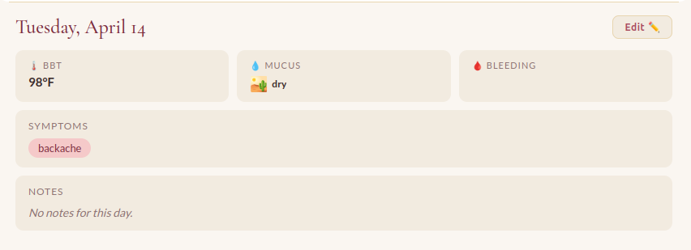
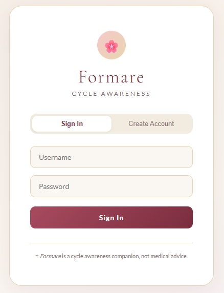

# Formare Documentation

## Front-End

### React Render

**DISCLAIMER: Claude helped to produce the code for the front-end as this was the first serious project we all (Ryan, John, and Arun) have particpated in utilizing React. An effort has been made to truly learn React through this project, but given the time constraints, we could not make the application we wanted without the reliance of coding tools.**

The Formare front-end relies on React as the foundational framework for presenting the User Interface and handling the User Experience. The React render is found in `/client/src/main.jsx` as 

```jsx
import { StrictMode } from 'react'
import { createRoot } from 'react-dom/client'
import './index.css'
import App from './App.jsx'

createRoot(document.getElementById('root')).render(
  <StrictMode>
    <App />
  </StrictMode>,
)
```

Though, it really just runs `/client/src/App.jsx` and pushes it to the `div element` with the ID "root" in `/client/index.html`. `App.jsx` handles the actual state of the webapp itself. All of the individual pages and components are separated out in `/client/src/pages/` and are imported into `App.jsx` for utilization.

### App.jsx Functionality and Pages

The application is unusable if not authentication and logged in, so the app first ensures that there is currently a user signed in; if not, then the user is sent to the login page:

```jsx
// handles the login logic
async function handleLogin() {
    const res  = await fetch("/auth", { credentials: "include" });
    const data = await res.json();
    if (data.loggedIn) setUser({ name: data.username });
  }

// handles the logout logic, calls a JS function "logout" to handle the backend token destruction.
  function handleLogout() {
    setUser(null);
    localStorage.removeItem("token");
    localStorage.removeItem("username");
    logout();
  }

  useEffect(() => {
    async function checkAuth() {
      try {
        // gets the authentication info from the backend
        const res  = await fetch("/auth", { credentials: "include" });
        // parses the response
        const data = await res.json();
        // if the user is logged in, update the user useState.
        if (data.loggedIn) setUser({ name: data.username });
        // otherwise, no user
        else setUser(null);
      } catch {
        setUser(null);
      } finally {
        setLoading(false);
      }
    }
    // actually calls the function
    checkAuth();
  }, []);

  if (loading) return <div className="app-loading">Loading…</div>;
  // if the user does not exist (is null), redirect to the login page. On login, call the handleLogin function
  if (!user)   return <LoginPage onLogin={handleLogin} />;
```

`App.jsx` imports each page from `/client/src/pages/` at the top and utilizes them alongside useState hooks to determine which page should be currently shown to the user. You can see that above with the `useEffect`, which utilizes the `setUser` useState hook and `setLoading`.

`App.jsx` is a big state machine which handles what the user currently sees and can do. 

For example, this is the primary return of `App.jsx`

```jsx
return (
    // wrapped in a Context that allows data persistence for the given user without multiple DB calls.
    <MonthStatusProvider>
      <div className="app-shell">

        {/* App header */}
        <header className="app-header">
          <div className="app-header-logo">
            <span className="app-header-icon">🌸</span>
            <h1 className="app-header-title">Formare</h1>
          </div>
          // utilizes the user useState hook to get the current users name.
          <span className="app-header-username">{user.name}</span>
        </header>

        {/* Main content */}
        <main className="app-content">
        // if the activeTab is the calendar view (the default dashboard), then it is loaded
        // with the dayOverview directly under it
          {activeTab === "calendar" && (
            <>
            // the code for this component is stored in /client/src/pages/CalendarView.jsx
              <CalendarView
                selectedDay={selectedDay}
                onSelectDay={d => setSelectedDay(d)}
              />
              <div className="calendar-divider" />
              <div className="day-overview-tab">
              // the code for this component is stored in /client/src/pages/DayOverview.jsx
                <DayOverview
                  day={selectedDay}
                  onEdit={d => { setEditDay(d); setView("edit"); }}
                />
              </div>
            </>
          )}
        // likewise, if the activeTab is something else, call that page instead.
          {activeTab === "insights" && <InsightsView />}
          {activeTab === "profile"  && <ProfileView user={user} onLogout={handleLogout} />}
        </main>

        {/* Tab bar */}
        <TabBar active={activeTab} onTab={tab => setActiveTab(tab)} />

      </div>
    </MonthStatusProvider>
  );
```

### Data Consistency

Instead of doing multiple calls per page or when the data is needed, the data for the given month is called in `/client/src/context/MonthStatusContext.js`. This is then exported for use across the whole project. 

For example, the `CalendarView.jsx` component utilizes this hook, `const { monthData, loading } = useMonthStatus();`, to get the monthData from `useMonthStatus` which is imported from `MonthStatusContext.js`. `monthData` is an `array of key-object pairs` where each **key is the day of the month (1-indexed), holding an object for every day of data recieved back from the database for a given month. 

To further explain, if `monthData[d]` is called and `d` is a day that does not exist as a key in the array, then `undefined` will be returned. 

This will look something like the following (this is test data for user admin):

```
Object { 1: {…}, 2: {…}, 3: {…}, 4: {…}, 5: {…}, 6: {…}, 7: {…}, 8: {…}, 9: {…}, 10: {…}, … }
    1: Object { date: "2026-04-01", bbt: 97.2, bleeding: "heavy", … }
    2: Object { date: "2026-04-02", bbt: 97.1, bleeding: "medium", … }
    3: Object { date: "2026-04-03", bbt: 97, bleeding: "light", … }
    4: Object { date: "2026-04-04", bbt: 97.1, bleeding: "spotting", … }
    5: Object { date: "2026-04-05", bbt: 97.2, bleeding: "brown", … }
    6: Object { date: "2026-04-06", bbt: 97.3, bleeding: "None", … }
    7: Object { date: "2026-04-07", bbt: 97.4, bleeding: "None", … }
    8: Object { date: "2026-04-08", bbt: 97.5, bleeding: "None", … }
    9: Object { date: "2026-04-09", bbt: 97.4, bleeding: "None", … }
    10: Object { date: "2026-04-10", bbt: 97.3, bleeding: "None", … }
    11: Object { date: "2026-04-11", bbt: 97.2, bleeding: "None", … }
    12: Object { date: "2026-04-12", bbt: 97.7, bleeding: "None", … }
    13: Object { date: "2026-04-13", bbt: 98, mucus: "moist", … }
    14: Object { date: "2026-04-14", bbt: 98, bleeding: "None", … }
    15: Object { date: "2026-04-15", bbt: 98.1, bleeding: "None", … }
    16: Object { date: "2026-04-16", bleeding: "heavy", mucus: "moist", … }
```

The app parses this data and presents the day (or days) necessary to be shown per the current screen.

The context calls the function `getMonthStatus` from `client/src/scripts/api/getMonthStatus.js` to get the desired info from the database. This will be further discussed in the `Back-End` section. 

### Data Presentation

The data is called through `MonthStatusContext.jsx` into wherever it is needed using hooks, as shown above. Once done, the page will typically call `const entry = monthData[day]` and then parse the `entry` variable for the necessary information. This returns an object corresponding to the day. 

Let's take the `DayOverview.jsx` component as an example.



First, the export function is defined `export default function DayOverview({ day, onEdit }) {` and the
month data is loaded `const { monthData, loading } = useMonthStatus();`

The given day entry is passed to a variable, `const entry = monthData[day];` and the date label ("Tuesday, April 14" in the above image) is created:

```jsx
const dateLabel = new Date(year, month, day).toLocaleDateString("en-US", {
    weekday: "long",
    month:   "long",
    day:     "numeric",
  });
```

Then, the actual return element is created:

```jsx
return (
    <div className="overview-wrap">
        // notice this is the top of the component with the date label and the edit button.
      {/* Day header */}
      <div className="overview-header">
        <h3 className="overview-date-label">{dateLabel}</h3>
        <button className="overview-edit-btn" onClick={() => onEdit(day)}>
          Edit ✏️
        </button>
      </div>

        // here is when the entry data is parsed into each individual element and presented
      {entry ? (
        <div className="overview-content">

          {/* Biomarker cards */}
          <div className="bio-row">
            // first is bbt, called as entry.bbt if it exists; otherwise, just a dash
            // this pattern follows the rest of the biomarkers.
            {/* BBT */}
            <div className="bio-card">
              <span className="bio-label">🌡️ BBT</span>
              <span className="bio-value">
                {entry.bbt ? `${entry.bbt}°F` : <span className="bio-value--muted">—</span>}
              </span>
            </div>

            //... cut out the rest of the elements, can be found in `/client/src/pages/DayOverview.jsx`

        </div>
      ) : (
        // or, if there is no entry for the given day, an element specifying that is returned instead.
        <div className="overview-no-entry">
          <p>No data recorded for this day.</p>
          <button
            className={`overview-add-btn`}
            style={btnPrimaryStyle}
            onClick={() => onEdit(day)}
          >
            Add Entry
          </button>
        </div>
      )}

    </div>
  );
```

### Month Status Context Explanation

In order for data to be consistently maintained throughout the program without recalling a bunch of documents from the database between each screen, a context is used called `MonthStatusContext.jsx`. This allows function `useMonthStatus()` to be called on whatever page necessary to get the data for a given month.

The provider function for the context uses the `useCallback` hook with an async callback function passing the `year` and `month` variables provided to the `useMonthStatus` function to call the `getMonthStatus` script from `/client/src/scripts/api/getMonthStatus.js`. This connects to the backend and queries for the desired information (the array of key-object pairs for a given month for a specific user). It then returns the provider, containing the hooks `monthData`, `loading`, and `loadMonth`. 

```jsx
export function MonthStatusProvider({ children }) {
  const [monthData, setMonthData] = useState({});
  const [loading, setLoading] = useState(true);

  const load = useCallback(async (year, month) => {
    setLoading(true);
    try {
      const data = await getMonthStatus(year, month + 1);

      if (data.empty) {
        // console.log("No data returned for month status:", data.message);
        setMonthData({});
        return;
      } else {
        // console.log("Processing month status data:", data);
        const map = {};
        data.forEach(entry => {
          const day = Number(entry.date.split("-")[2]);
          map[day] = {
            ...entry,
            symptoms: typeof entry.symptoms === "string" && entry.symptoms.trim()
              ? entry.symptoms.split(",").map(s => s.trim())
              : [],
          };
        });
        setMonthData(map);
      }
    } finally {
      setLoading(false);
    }
  }, []);

  useEffect(() => {
    load(YEAR, MONTH);
  }, [load]);

  return (
    <MonthStatusContext.Provider value={{ monthData, loading, loadMonth: load }}>
      {children}
    </MonthStatusContext.Provider>
  );
}
```
**A few important things to note:**
1. The snippet with `data.forEach` is where the returned `data` from `getMonthStatus` is turned into the key-object pair. The map object array is defined as empty before it is filled with a numeric dictionary where the key is the number of the day from the data object entry and the object linked to it is the rest of the entry.
2. Notice the snippet `await getMonthStatus(year, month + 1)` and how `month` has 1 added to it. This is because months in JS are 0-indexed but the database stores them as 1-indexed.
3. The way the backend passes symptoms to the front is through an comma-separated string. I'm not sure how we ended up making that happen, but here it is turned back into an array as it is meant to be. In the future, that needs to be changed and this snipped for symptoms removed. The above snippet for `symptoms` maps each entry into a new `symptoms` array. 

**Here is an example of this in use:**

In `CalendarView.jsx`, `viewMonth` and `viewYear` are stored as states using `useState` hooks. When these are changed in places such as the following code snippet:

```jsx
// Initially, the data is loaded with the current MONTH and YEAR via the useState and useEffect hooks
const [viewMonth, setViewMonth] = useState(MONTH);
const [viewYear, setViewYear] = useState(YEAR);
const { monthData, loading, loadMonth } = useMonthStatus();
              |
              V
// this button calls handleMonthChange with an increment
<button onClick={() => handleMonthChange(1)} className="nav-arrow-side">→</button>
              |
              V
//leads to the handleMonthChange function
const handleMonthChange = (direction) => {
    const newDate = new Date(viewYear, viewMonth + direction, 1);
    setViewMonth(newDate.getMonth());
    setViewYear(newDate.getFullYear());
};
              |
              V
// when the setViewMonth or setViewYear hooks are used and their respective states changed, useEffect is triggered
useEffect(() => { 
    // console.log("Month or year changed, loading month status for", viewYear, viewMonth + 1);
    loadMonth(viewYear, viewMonth); // Load data for the current month/year when they change
    onSelectDay(selectedDay, viewMonth, viewYear); // Pass month and year to parent when changing month
}, [viewMonth, viewYear, loadMonth]);
// This uses loadMonth from the MonthStatusContext.Provider which triggers the information to reload using the new month and/or year.
// Now, monthData is something new, either it is empty because it is a month with no data or it possesses some data to show in the month.
```

## Back-End

### Stack and File Config
This segues nicely into the backend. 

The Back-End Stack consists of **Node.JS, Express.JS, express-session, MongoDB via Mongoose, and dotenv**.
The structure is broken up nicely into the following sections:

```
/server/
|-config/
|----db.js (handles mongoose DB connection)
|-controllers/
|----authControllers.js (handles User model related DB calls for login/logout)
|----bodyStatusControllers.js (handles DB calls related to cycle information)
|----dbControllers.js (handles DB calls related to user creation or info editing)
|-middleware/
|----session.js (handles session)
|-models/
|----BodyStatus.js (mongoose model for BodyStatus)
|----User.js (mongoose model for User)
|-routes/ (all the related routes to the above controllers)
|----authRoutes.js
|----bodyStatusRoutes.js
|----dbRoutes.js
|----sessionRoutes.js
|-app.js (actual Node.JS app)
|//
```

`App.js` is set up where it handles the routes in this order:

```js
app.use('/', sessionRoutes);
app.use('/', authRoutes);
app.use('/', dbRoutes);
app.use('/', bodyStatusRoutes);
```

So, the server, when it recieves a request, will check in that order. 

### Environment Variables
The only environment variables utilized is `MONGO_URI` and `SESSION_SECRET`. Of course, not going to share those here, but if you're going to do a local boot of the project, you'll have to link it to your own MongoDB. dotenv is used to load these variables via `import dotenv/config` in `/server/app.js`. 

These variables are stored in `/server/.env` and look as follows:
```
MONGO_URI=your_mongodb_connection_string
SESSION_SECRET=your_secret_here
```
*(The session secret should be a long, random, unguessable string in any deployed environment.)*

### Database Definition and Mongoose Models

The Formare database has two collections, `bodystatuses` and `users` each with their respective **mongoose model** in the program, these being `/server/models/BodyStatus.js` and `/server/models/User.js`. These models are necessary to use mongoose. They define the collection schemas. 

**BodyStatus.js**
```js
import mongoose from 'mongoose';

const bodyStatusSchema = new mongoose.Schema({
    date: { type: String, required: true },
    username: { type: String, required: true },
    basilBodyTemp: { type: Number, required: false },
    mucusSensations: { type: String, required: false },
    mucusCharacteristics: { type: String, required: false },
    bleeding: { type: String, required: false },
    secondaryBiomarkers: { type: [String], required: false },
    notes: { type: String, required: false }
});

bodyStatusSchema.index({ username: 1, date: 1 }, { unique: true });

export const BodyStatus = mongoose.model('BodyStatus', bodyStatusSchema);
```

Notice that BodyStatus uses a compound index on username and date to enforce uniqueness and optimize the month-based queries the app relies on.

**User.js**
```js
import mongoose from 'mongoose';

const userSchema = new mongoose.Schema({
    username: { type: String, required: true, unique: true },
    password: { type: String, required: true }
});

export const User = mongoose.model('User', userSchema);
```
**EXAMPLE UTILIZATION** <br>
These are utilized strictly in the back-end to formulate a response to an HTTP request from the front-end and are used as follows:

1. A request is sent to a given middleware endpoint from the front-end (for this example, let's say `/auth/login` which corresponds to the back-end function `login` from `/server/controllers/authControllers.js`)
2. The function is called, passing in `req, res` as parameters.<br>
3. Immediately, two things occur: <br>
(1) The variables `username` and `password` are destructured from the request body and <br>
(2) A variable named `user` is created utilizing the imported `User` model and the `findOne` function to search the collection for any documents in the `user` collection that correspond to the given `username`. <br>
```js
import { User } from '../models/User.js';

export async function login(req, res) {
  const { username, password } = req.body;
  const user = await User.findOne({ username });
  ...
```
*Passwords are hashed prior to being sent over HTTP to the backend*
4. Variable `user` is now either undefined or returned an object matching the given `User` document.
5. The information is used according to the need of the given function.

This same structure would be repeated for utilization of the other models. 

For example, in `/server/controllers/bodyStatusController.js`, `BodyStatus` from `/server/models/BodyStatus.js` is utilized as follows:
```js
const bodyStatus = await BodyStatus.find({
            date: new RegExp(`^${year}-${mm}`),
            username
        }).lean();
```
Where the `find` function is passed the `date` in form `YYYY-MM` and the `username` to find the subset of documents that match the criteria. The `lean` function is used to ensure Mongoose returns a **plain JavaScript object** as opposed to a full Mongoose document, **which is faster and more sufficient when only reading data**.

### Data Call Example

Using the above example of `getMonthStatus`, let's trace that file from front to back and back to front.

First, the script at `client/src/scripts/api/getMonthStatus.js` is called inside `MonthStatusContext.jsx`.
The desired YEAR and MONTH is passed to the function and the request is formulated and sent to the backend:

```js
const res = await fetch(
      `/api/month-info?year=${year}&month=${month}`,
      {
          method: 'GET',
          credentials: "include"
      }
    );
```

This heads to the server where it tries to deduce where the route is from, given the above list. It checks and finally lands at `router.get('/api/month-info', getMonthStatus)`, where `getMonthStatus` comes from `server/controllers/bodyStatusController.js`. 

`getMonthStatus` recieves the req and res as arguments and immediately checks whether or not the user is logged in. If not authenticated, then the user is denied access; otherwise, the process continues:

```js
// gets the current user and parses the req query out into year and month from the above fetch.
    const { username } = req.session.user;
    const { year, month } = req.query;
      
    // the month is padded to ensure appropriate data is passed to the database query.
    const mm = String(month).padStart(2, "0");

    // console.log(`Fetching body status for ${username} for ${year}-${mm}`);
    try {
        // the BodyStatus model is used to find the desired month of data, using the indexed call
        // required the current data and user. 
        const bodyStatus = await BodyStatus.find({
            date: new RegExp(`^${year}-${mm}`),
            username
        }).lean();

        // then, if something is returned,
        if (bodyStatus.length > 0) {
            // the information is formatted to a new array via a map to ensure all the desired values
            // are present, either as null or recorded data.
            const formatted = bodyStatus.map(entry => ({
                date: entry.date,
                bbt: entry.basilBodyTemp ?? null,
                bleeding: entry.bleeding ?? null,
                mucus: entry.mucusSensations ?? null,
                mucusCharacteristic: entry.mucusCharacteristics ?? null,
                notes: entry.notes ?? "",
                symptoms: entry.secondaryBiomarkers?.length
                    ? entry.secondaryBiomarkers.join(", ")
                    : ""
            }));
          
            // finally, this data is returned.
            return res.json(formatted);
        } else {
            return res.status(404).json({ message: 'No body status found for the specified date' });
        }
    } catch (err) {
      console.error('Error fetching body status:', err);
      return res.status(500).json({ message: 'Error fetching body status' });
    }
```

Hopping back to the front-end script, we await the response then return it if a proper response was given.

```
const data = await res.json();
      
    if (!res.ok) {
      throw new Error(data.error || 'Failed to fetch month status');
    }
    
    return data;
```

This response corresponds with the above **array of objects** with each object corresponding to a key (the key is the number of the day).

### Database Design Explanation

The database was designed this way with the help of **Professor Jason Watson** from the University of North Alabama over a short meeting. He instructed that a document database such as MongoDB is built around transactions, which essentially is a question asked by the user in a given scenario that represents the primary function of the application.

Formare's question is this: **"What is my body status for a given cycle?"**
A cycle is about 28 days on average, and thus fits nicely into a calendar month. 

*"Data presented together should be stored together,"* or so he said, and thus came the schema design.
Each document represents a specific day for a given user and contains all the information inputted from the front-end UI.
This is why there is the normalization process of formatting the response as seen above in the database back-end query script. It's for the sake of front-end ease of display so that every possible option is present either as null or actual data. 

When `getMonthStatus` is called, a `find` statement for the documents relating to a given user in a specific month of a specific year is ran. The reason for this is because the main dashboard of Formare is a calendar view, and this nicely presents away to get all the immediately necessary data without multiple database calls. 

### Authentication Flow

With an understanding of the database out of the way, we can move into the explanation of the authentication flow. 

In `App.jsx` on the front end, the main ``App`` function checks via a `useEffect` hook whether or not the user is currently logged in via the backend `/auth` route. If user is logged in, the user is sent to the Calendar view dashboard; otherwise, they are sent to the login page: 
```js
if (!user)   return <LoginPage onLogin={handleLogin} />;
```
The `LoginPage` component handles both registration and logging in via togglable modes. We will run through both.<br>


**LOGIN:**
1. The `LoginPage` component returns the following divs for form input where `isLogin` is either `"login"` or `"register"`. 
<br>If the mode is `"login"` and the user clicks the button, presumably after having put their information in, the information is passed via the hooks `setUsername` and `setPass` to `handleLogin`.
```js
{/* Inputs */}
        <div style={{ display: "flex", flexDirection: "column", gap: 14 }}>
          <input
            type="text" placeholder="Username" value={username}
            onChange={e => { setUsername(e.target.value); setErr(""); }}
            style={inputStyle}
          />
          <input
            type="password" placeholder="Password" value={pass}
            onChange={e => { setPass(e.target.value); setErr(""); }}
            onKeyDown={e => e.key === "Enter" && (isLogin ? handleLogin() : handleRegister())}
            style={inputStyle}
          />
          // for if mode is "register"
          {!isLogin && (
            <input
              type="password" placeholder="Confirm Password" value={confirmPass}
              onChange={e => { setConfirmPass(e.target.value); setErr(""); }}
              onKeyDown={e => e.key === "Enter" && handleRegister()}
              style={inputStyle}
            />
          )}
          {err && <p style={{ color: "var(--rose-deep)", fontSize: 13, textAlign: "center" }}>{err}</p>}
          // here is the bread and butter, where onClick sends to one of two functions, handleLogin or handleRegister.
          <button onClick={isLogin ? handleLogin : handleRegister} style={btnPrimaryStyle}>
            {isLogin ? "Sign In" : "Create Account"}
          </button>
        </div>
```
2. `handleLogin` is a function inside `LoginPage.jsx` which does exactly as it says. It will check the state hooks for username and password and return back to the LoginPage if the input is invalid. Otherwise, it will send the variables `username` and `password` to the `login` function from `/client/src/scripts/auth/login.js`. 
```js
const data = await login(username, pass);
```
3. The `login` function on the front-end passes the parameters of `username` and `password` in the form of an HTTP request to the back-end through the back-to-slash `/auth/login` and awaits a response.
```js
export async function login(username, password) {
    const res = await fetch('/auth/login', {
        method: 'POST',
        headers: {
            'Content-Type': 'application/json'
        },
        body: JSON.stringify({ username, password })
    });

    const data = await res.json();

    return data;
};
```
4. `/auth/login` gets routed through the server `app.js` on the backend (`/server/app.js`) to `/server/routes/authRoutes.js` and sent to the `login` function at `/server/controllers/authControllers.js`.
```js
router.post('/auth/login', login);
```
5. The `login` function on the backend now parses the request body and queries the `User` mongoose model as shown above in the **Database Definition and Mongoose Models** section to see if the given username exists in the collection. 
<br>If the user is not found, then a 401 is returned; otherwise, the passwords are matched using `bcrypt.compare`.
<br>If the passwords do not match, another 401 is returned; otherwise the `req.session.user` variable is updated and saved and a response JSON is sent back to the front end.
```js
export async function login(req, res) {
  const { username, password } = req.body;
  const user = await User.findOne({ username });
  // console.log('Password encrypted in DB:', bcrypt.hash(password, 10)); // Log the encrypted password for debugging

  if (!user) {
    return res.status(401).json({ success: false, message: "Invalid username or password." });
  }

  const match = await bcrypt.compare(password, user.password);
    
  if (!match) {
    return res.status(401).json({ success: false, message: "Invalid username or password." });
  }

  // create session
  req.session.user = { id: user._id, username: user.username };
  req.session.save();
  // console.log('User logged in:', req.session.user); // Log the session user for debugging
  res.json({ success: true, username: req.session.user.username, token: req.sessionID });
};
```
6. The response is sent back to the frontend `login` function, then returned to the `LoginPage.jsx` component. The `LoginPage` component sees if the login was a success: if not, then an error is passed as "Invalid Credentials"; if so, the `onLogin` hook (which is a prop of the `LoginPage` component) is updated with the `username` and `session token` from the HTTP response and the local storage is updated with them also.
```js
async function handleLogin() {
    if (!username || !pass) { setErr("Please fill in all fields."); return; }
    if (pass.length < 4) { setErr("Password too short."); return; }

    try {
      const data = await login(username, pass);
      if (!data.success) { setErr("Invalid credentials."); return; }
      onLogin({ name: data.username, token: data.token });
      localStorage.setItem("token", data.token);
      localStorage.setItem("username", data.username);
    } catch (error) {
      setErr("Something went wrong. Please try again.");
    }
  }
```
7. When the `onLogin` hook is updated, the React `App.jsx` now runs its own `handleLogin` function to update the state of the app itself.
This is the code to present the user with the `LoginPage` component in the first place, `if (!user)   return <LoginPage onLogin={handleLogin} />`. What runs next is an HTTP request to verify a successful login:
```js
 async function handleLogin() {
    const res  = await fetch("/auth", { credentials: "include" });
    const data = await res.json();
    if (data.loggedIn) setUser({ name: data.username });
  }
```
8. The `/auth` middleware (located at `/server/routes/authRoutes.js`) is rather simple, and simply checks if `req.session.user` exists or not: if so, it returns success; if not, it returns false.
```js
 router.get('/auth', (req, res) => {
    // console.log('Checking auth status for session:', req.session.user);
    if (req.session.user) {
        res.status(200).json({ loggedIn: true, username: req.session.user.username });
    } else {
        res.status(401).json({ loggedIn: false });
    }
});
```
9. Now, since the user is logged in, the React `App.jsx` useState hook `setUser` updates the current user's name with the returned response and the user is officially logged in on both the back and front end.

**REGISTER:**
1. If the user clicks "Create Account" on the login screen, they are presented with a different screen which adds the input field "Confirm Password"; however, much of the process is the same as above. Instead of `handleLogin` being called, `handleRegister` is called. `handleRegister` checks to make sure:
<br>(1) Username, Password, and Confirm Password are not empty
<br>(2) Password length is greater than 4 characters (will be more stringent later on)
<br>(3) Password and Confirm Password match
<br>If any one of these are not true, then the function simply returns; otherwise, the three variables are passed to the `register` function located at `/client/src/scripts/auth/register.js`
```jsx
async function handleRegister() {
    if (!username || !pass || !confirmPass) { setErr("Please fill in all fields."); return; }
    if (pass.length < 4) { setErr("Password must be at least 4 characters."); return; }
    if (pass !== confirmPass) { setErr("Passwords do not match."); return; }

    try {
      const data = await register(username, pass, confirmPass);
      if (!data.success) { setErr(data.message || "Could not create account."); return; }
      switchMode("login");
      setErr("Account created! Please log in.");
    } catch (error) {
      setErr("Something went wrong. Please try again.");
    }
  }
```
2. `register.js` sends the variables in the form of a request to endpoint `/api/auth/register` via a HTTP request.
```js
export async function register(username, password, confirmPassword) {
  const res = await fetch("/api/auth/register", {
    method: "POST",
    headers: { "Content-Type": "application/json" },
    body: JSON.stringify({ username, password, confirmPassword }),
  });
  return res.json();
}
```
3. Since this API endpoint updates the database, instead of being routed in the `authRoutes.js` file, it is routed in the `dbRoutes.js` file, specifically `router.post('/api/auth/register', register);` which points to the `register` function in `/server/controllers/dbControllers.js`. This was an architectural decision because of separation of concerns. Register does not automatically log the user in upon creation; rather, it merely creates the user in the database and allows the user the possibility of logging in. For this reason, `dbControllers.js` is utilized instead of `authControllers.js`.
4. The register function destructures the variables from the request body and immediately double checks whether or not the `password` and `confirmPassword` variables match. Then, the `User` model is checked to ensure that the user under the given `username` does not already exist. If not, then the password is hashed and a new user is created with the given `username` and hashed `password` and saved. 
```js
export async function register(req, res) {
  try {
    const { username, password, confirmPassword } = req.body;

    if (password !== confirmPassword) {
      return res.status(400).json({ success: false, message: "Passwords do not match" });
    }

    const existingUser = await User.findOne({ username });
    if (existingUser) {
      return res.status(400).json({ success: false, message: "Username already exists" });
    }

    const hashedPassword = await bcrypt.hash(password, 10);
    const newUser = new User({ username, password: hashedPassword });
    await newUser.save();

    res.json({ success: true, username });
  } catch (err) {
    console.error("Registration error:", err);
    res.status(500).json({ success: false, message: "Server error" });
  }
}
```
5. We return back to the front-end `register` script which returns the data to the `handleRegister` function in `LoginPage.jsx`. 
6. If the user creation was a success, then the `mode` hook state variable is changed to "login" and the page shows the login page with the message "Account created! Please log in." and user registration is complete.

**LOGOUT:**
1. The capability of logging out is present only on the `ProfileView.jsx` component. It is given the props `user` and `onLogout` from `App.jsx`. When the logout button is clicked, `onLogout` is called which returns to `App.jsx` and the function `handleLogout` is ran. `handleLogout` does the following:
<br>(1) Sets the useState hook `user` to `null`. 
<br>(2) Removes the local storage items `token` and `username`.
<br>(3) Calls the `logout` function from `/client/src/scripts/auth/logout.js`
```js
function handleLogout() {
    setUser(null);
    localStorage.removeItem("token");
    localStorage.removeItem("username");
    logout();
  }
```
NOTE: Since `setUser` is ran prior to `logout`, the user appears to be logged out before they actually are.

2. The `logout` function is rather straight forward, sending a HTTP POST request to endpoint `/auth/logout`.
```js
export async function logout() 
{
    try {
        const res = await fetch('/auth/logout', {
            method: "POST",
            credentials: "include"
        });
        
        if (!res.ok) throw new Error("Logout failed");
    } catch (err) 
    {
        console.error("Logout Error: ", err);
    }
}
```
3. This endpoint is routed through `/server/routes/authRoutes.js` to the `logout` function at `/server/controllers/authControllers.js`. 
4. The `logout` function in `authControllers.js` attempts to run the `req.session` function `destroy` which will also clear the connection cookie. It either returns response 500 for an internal failure of 200 for a success.
```js
export async function logout(req, res) 
{
  // console.log("Logout");
  req.session.destroy(err => {
    if (err) {
      console.error("Session destroy error: ", err);
      return res.status(500).json({success: false});
    }

    res.clearCookie("connect.sid");

    res.status(200).json({success: true});
  });
}
```
5. The user is logged out on the frontend immediately upon clicking logout, with the session destroyed on the backend shortly after.

# Sections to Add to Documentation

## Front-End
- Edit flow, how the "edit" view actually works (how a user edits or adds an entry)
- CSS/styling approach

## Back-End
- Session handling, what does session middleware do and how long does the session last
- Other routes, like dbRoutes

## General
- Known limitations or TODOs.

(* = important next steps to document).